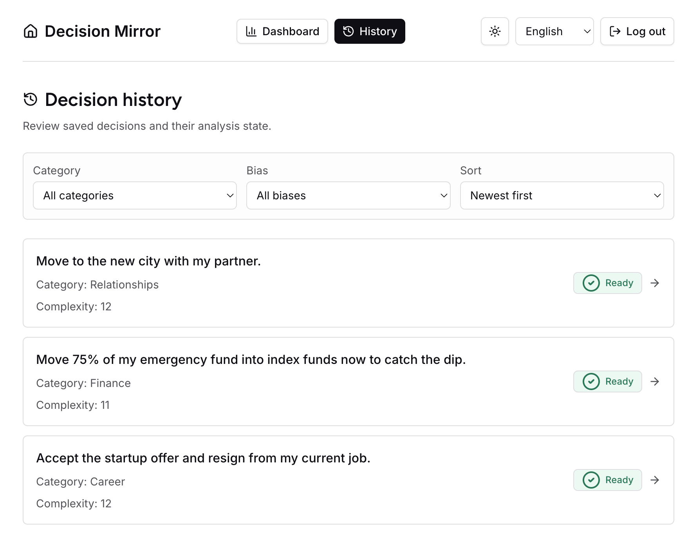
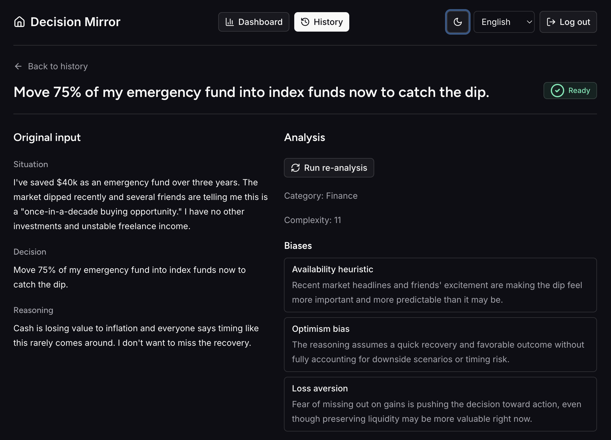
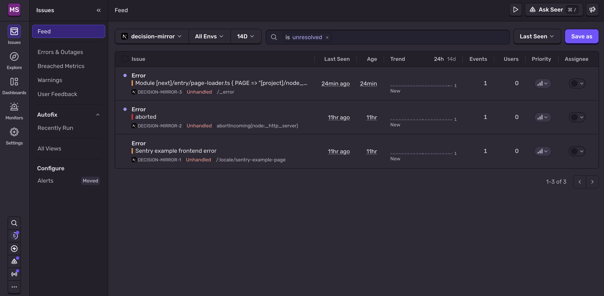
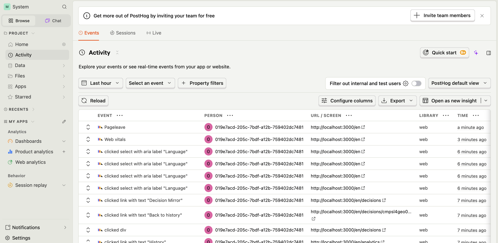
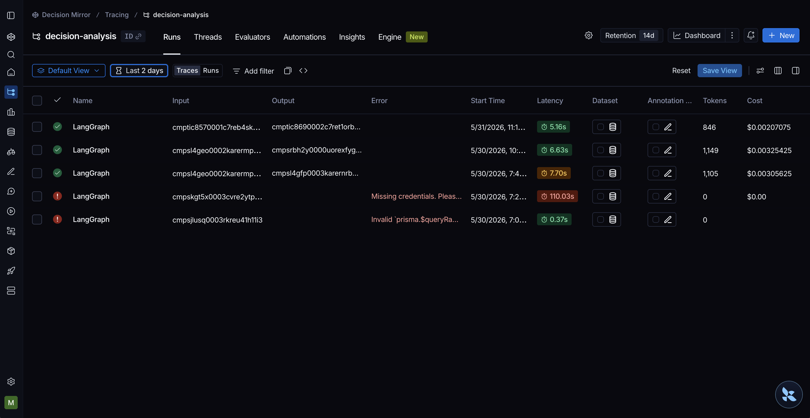

# Decision Mirror

> A private decision journal that reflects your choices back at you.

**Live:** https://decision-mirror.mykhailom.org/

Decision Mirror is a private decision journal. You write down a decision you're about to
make — the situation, the call, and your reasoning — and an LLM agent reflects it back:
surfacing likely **cognitive biases**, missed alternatives, failure modes, and hidden
assumptions. The goal is to let you see a choice from the outside *before* it becomes a
regret.

| History | Analysis |
|---------|----------|
|  |  |

Each decision is captured, scored for complexity, categorised (Career, Finance,
Relationships, …), and analysed asynchronously in the background. When analysis is ready,
the detail view shows the biases the agent detected, with a short explanation for each —
and you can always re-run the analysis.

---

## Running it locally

### Prerequisites

- **Node.js 24.x** and **pnpm 11**
- **Docker** (for local Postgres + pgvector)
- API keys for OpenAI (analysis) and an embeddings provider (Voyage AI by default)

### 1. Install & configure

```bash
pnpm install
cp .env.example .env.local   # then fill in real values
```

`.env.example` documents every variable. The minimum to boot the app:

- `DATABASE_URL` — defaults to the docker-compose Postgres below
- `AUTH_SECRET` — generate with `openssl rand -base64 32`
- `AUTH_GOOGLE_ID` / `AUTH_GOOGLE_SECRET` — Google OAuth (email/password also works)
- `OPENAI_API_KEY` — used by the analysis agent
- `VOYAGE_API_KEY` — used for long-term agent memory (embeddings)

### 2. Start the database

```bash
docker compose up -d          # Postgres 17 + pgvector, same engine as production
pnpm db:migrate               # apply Prisma migrations
pnpm db:setup-checkpointer    # provision the LangGraph PostgresSaver tables
```

### 3. Run the dev server

```bash
pnpm dev                      # http://localhost:3000
```

### Quality gate & tests

Run the full gate before declaring anything done (it's also enforced in CI):

```bash
pnpm lint && pnpm typecheck && pnpm test
```

Other useful scripts:

| Command | What it does |
|---------|--------------|
| `pnpm test:watch` | Vitest in watch mode |
| `pnpm test:integration` | Integration tests (sets up the checkpointer first) |
| `pnpm test:e2e` | Playwright end-to-end tests |
| `pnpm build` / `pnpm start` | Production build / serve |

> The LLM provider is **always mocked** in unit, integration, and e2e tests — they are
> deterministic and run fully offline. Only evals call a real model, and evals are not a
> commit gate.

---

## Architecture (brief)

Decision Mirror is **one TypeScript codebase, one deployment, one datastore**: a single
Next.js App Router app on Vercel, persisting everything in one PostgreSQL instance.

```
Browser  (shadcn/ui · dark mode · next-intl en/uk)
   │
   ▼
Next.js App Router (Vercel)
   ├─ Server Components — history, dashboard, detail views
   ├─ Route Handlers     — capture, status polling, retry/re-analyze
   ├─ Auth.js v5         — Google OAuth + email/password
   └─ after()/waitUntil  — fire the agent run after the response is sent
        │
        ▼
LangGraph.js (in-process StateGraph)
   load-memory → analyze (LLM, structured) → validate (Zod) → persist + remember
        │
        ▼
PostgreSQL  (single instance)
   ├─ Prisma        — User / Decision / Analysis (with version history)
   ├─ pgvector      — long-term cross-decision memory (semantic recall)
   └─ PostgresSaver — LangGraph checkpointer (per-run state, retry/resume)
```

The architecturally hardest path is **"save now, analyse in the background, show status."**
On serverless there's no long-lived worker, so a `POST /api/decisions` persists the record
and returns `201` immediately, then `waitUntil(runAgent(decisionId))` continues the work
after the response is sent. The client polls a status endpoint with backoff until the
analysis settles to `ready` or `failed`.

The agent lives behind a single `runAgent(decisionId)` seam in `agent/`, and the LLM
boundary is **contract-first** — the model returns schema-validated structured output
(start at `agent/schema.ts`), keeping non-determinism contained and the rest of the system
deterministic.

**Read more:**

- [`ARCHITECTURE.md`](./ARCHITECTURE.md) — the entry point, with all key decisions
- [`architecture/02-stack.md`](./architecture/02-stack.md) — stack, agent, memory, auth
- [`architecture/04-observability.md`](./architecture/04-observability.md) — Sentry / PostHog / LangSmith
- [`architecture/05-testing.md`](./architecture/05-testing.md) — the testing pyramid & TDD doctrine
- [`AGENTS.md`](./AGENTS.md) — the working agreement (TDD, boundaries, validation)

---

## Production ready

Observability is built in from day one — **errors, product behaviour, and agent reasoning
are each traced independently**. No decision *content* is ever sent to error/product
tooling (IDs, enums, counts, and durations only); LangSmith may see content by design and
is kept scoped.

### Sentry — errors & performance

Client + server + edge coverage in a single SDK, with release tagging and source-map upload
in CI.



### PostHog — product & business analytics

Funnels, retention, feature flags, and business KPIs. Server-side lifecycle events via
`posthog-node`, client-side view/locale events via `posthog-js`.



### LangSmith — agent tracing & evals

Per-run traces of the LangGraph agent, including latency, token usage, and cost, plus a home
for offline evals (kept out of the TDD commit loop).



---

## Built with OpenSpec

This project was built using **[OpenSpec](https://openspec.dev/)** — a spec-driven
development workflow where each unit of work starts as a *change proposal* (design + specs +
tasks) that is reviewed and then implemented, and archived once shipped. The trail lives in
[`openspec/`](./openspec/): live capabilities in
[`openspec/specs/`](./openspec/specs/) (authentication, agentic-analysis, agent-memory,
decision-capture, analytics-dashboard, internationalization, observability, …) and the
shipped history in [`openspec/changes/archive/`](./openspec/changes/archive/).

It pairs naturally with agentic coding: the spec is the shared contract between human and
agent, which kept the TDD-first, contract-first discipline of this repo coherent across many
incremental changes.

### Cons of this approach

Spec-driven development is not free. In practice, the trade-offs were:

- **Up-front overhead.** Every change requires writing a proposal, design notes, and a spec
  delta *before* code. For small or obvious changes this ceremony can cost more than the work
  itself.
- **Spec drift.** Specs are only valuable if they stay true. When implementation outpaces the
  docs, the `openspec/` tree silently becomes fiction — and a stale spec is worse than no
  spec.
- **Duplication of intent.** The same decision is often expressed in the proposal, the spec,
  the tests, and the code. Keeping four representations in sync is real maintenance work.
- **Premature precision.** Writing a detailed spec assumes you understand the problem well
  enough to specify it. For genuinely exploratory work, locking a spec early can anchor you to
  the wrong design and discourage cheap iteration.
- **Tooling lock-in & learning curve.** The workflow (propose → apply → archive) and its
  directory conventions are another system contributors must learn and tooling must support;
  the payoff only materialises at a certain project size and pace.

For Decision Mirror — a multi-capability app built incrementally with AI agents — the
benefits (a durable, reviewable contract and a clean audit trail of *why* each change
happened) outweighed these costs. On a smaller or more experimental project, the balance
could easily tip the other way.

---

## License

Private project — all rights reserved.
